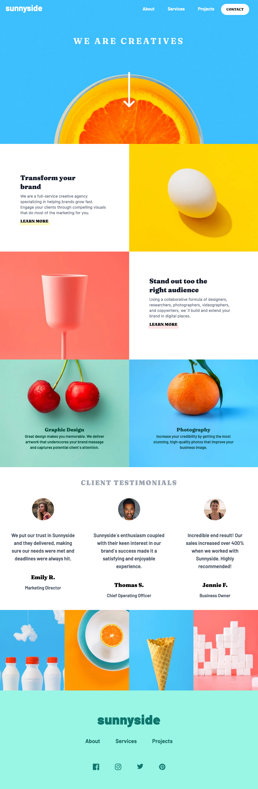
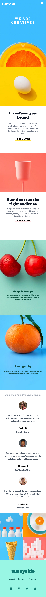
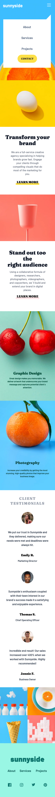

# Frontend Mentor - Sunnyside agency landing page solution

This is a solution to the [Sunnyside agency landing page challenge on Frontend Mentor](https://www.frontendmentor.io/challenges/sunnyside-agency-landing-page-7yVs3B6ef). Frontend Mentor challenges help you improve your coding skills by building realistic projects.

## Table of contents

- [Overview](#overview)
- [The challenge](#the-challenge)
- [Screenshot](#screenshot)
- [Links](#links)
- [My process](#my-process)
- [Built with](#built-with)
- [What I learned](#what-i-learned)
- [Continued development](#continued-development)
- [Useful resources](#useful-resources)
- [Author](#author)
- [Acknowledgments](#acknowledgments)

## Overview

This was my first project using Next.js, Typescript and Tailwind. As I expected it was heavy on the tailwind but an easy introduction into Next.js and Typescript. 

### The challenge

Users should be able to:

- View the optimal layout for the site depending on their device's screen size
- See hover states for all interactive elements on the page

### Screenshot

### Links

- Solution URL: [Add solution URL here](https://github.com/timbosTours/Frontend-Mentor-Sunnyside-Agency)
- Live Site URL: [Add live site URL here](https://magenta-pothos-3bdd34.netlify.app/)

## My process

I went with a mobile first approach starting at the top with the nav and the banner. Working my way down to the footer and then adding media queires with tailwind to create a truly responsive website. finishing off with effects and most importantly accessibility. 

### Built with

- Semantic HTML5 markup
- CSS Grid
- Mobile-first workflow
- [React](https://reactjs.org/) - JS library
- [Next.js](https://nextjs.org/) - React framework
- [Typescript](https://www.typescriptlang.org/)
- [Tailwind](https://tailwindcss.com/)

### What I learned

- I learned Tailwind can make for some messy components, but the mess can be reduced with; [Inline-fold](https://github.com/moalamri/vscode-inline-fold)

- I learned that Typescript is pretty easy to just turn on and learn as you go.

- I learned that Next.js gives you SEO benifits on top of a react app.

### Continued development

Th fonts don't render perfectly all the time. 

### Useful resources

- [Underline](https://github.com/tailwindlabs/tailwindcss/issues/1936) - This helped me get around tailwind to create a rounded underline.

## Author

- Website - [Timothy Fawcett](https://www.linkedin.com/in/timothyfawcett89/)
- Frontend Mentor - [@timbosTours](https://www.frontendmentor.io/profile/timbosTours)
- Twitter - [@timbosTours](https://www.twitter.com/timbosTours)

## Acknowledgments

Super grateful to Frontend Mentor and anyone who reviews my code :)

